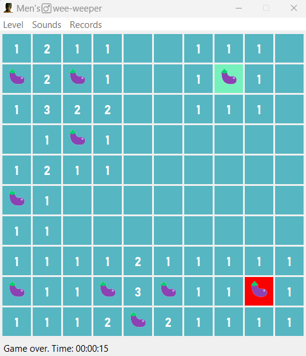

# 10X10 minesweeper inspired by Gachimuchi

## Stack

- **Language**: Python 3.13.5
- **GUI**: Tkinter (built-in Python library, tk==0.1.0)
- **Image processing**: Pillow (PIL) (for drawing images for mines and flags, pillow==12.1.1)
- **Sounds**: pygame.mixer (part of Pygame, for sound effects, pygame==2.6.1)

## Installation and launch

1. Clone the repo: `git clone ...`
2. Go to the project folder: `cd project`
3. Create and activate a virtual environment:
   ```bash
   python -m venv .venv
   source .venv/bin/activate  # for Linux/macOS
   .venv\Scripts\activate     # for Windows
   ```
4. Install the requirements:
   ```bash
   pip install -r requirements.txt
   ```
5. Launch:
   ```bash
   python src/main.py
   ```

   
